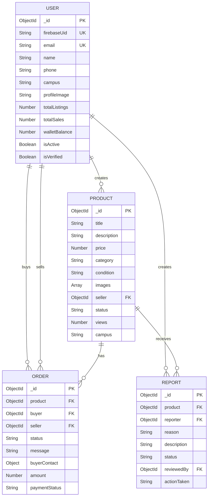

# LocalBazaar Pro - Database Schema

## Overview

MongoDB database with Mongoose ODM. All models use timestamps (createdAt, updatedAt) automatically.

---

## Collections

### Users Collection

**Model:** `User`

**Purpose:** Store user account information and statistics

**Schema:**
```javascript
{
  firebaseUid: {
    type: String,
    required: true,
    unique: true,
    index: true
  },
  email: {
    type: String,
    required: true,
    unique: true,
    lowercase: true,
    trim: true
  },
  name: {
    type: String,
    required: true,
    trim: true
  },
  phone: {
    type: String,
    trim: true
  },
  campus: {
    type: String,
    required: true,
    trim: true
  },
  profileImage: {
    type: String,
    default: null
  },
  totalListings: {
    type: Number,
    default: 0
  },
  totalSales: {
    type: Number,
    default: 0
  },
  walletBalance: {
    type: Number,
    default: 0
  },
  isActive: {
    type: Boolean,
    default: true
  },
  isVerified: {
    type: Boolean,
    default: false
  },
  createdAt: Date,
  updatedAt: Date
}
```

**Indexes:**
- `firebaseUid` (unique)
- `email` (unique)
- `campus`

**Example Document:**
```json
{
  "_id": "65a1b2c3d4e5f6g7h8i9j0k1",
  "firebaseUid": "firebase_uid_123",
  "email": "john@example.com",
  "name": "John Doe",
  "phone": "1234567890",
  "campus": "Main Campus",
  "profileImage": "https://cloudinary.com/profile.jpg",
  "totalListings": 5,
  "totalSales": 2,
  "walletBalance": 0,
  "isActive": true,
  "isVerified": false,
  "createdAt": "2024-01-15T10:00:00.000Z",
  "updatedAt": "2024-01-15T10:00:00.000Z"
}
```

---

### Products Collection

**Model:** `Product`

**Purpose:** Store product listings

**Schema:**
```javascript
{
  title: {
    type: String,
    required: true,
    trim: true,
    maxlength: 100
  },
  description: {
    type: String,
    required: true,
    trim: true,
    maxlength: 1000
  },
  price: {
    type: Number,
    required: true,
    min: 0
  },
  category: {
    type: String,
    required: true,
    enum: ['Electronics', 'Books', 'Furniture', 'Clothing', 
           'Sports', 'Stationery', 'Accessories', 'Other']
  },
  condition: {
    type: String,
    required: true,
    enum: ['New', 'Like New', 'Good', 'Fair']
  },
  images: [{
    type: String,
    required: true
  }],
  seller: {
    type: ObjectId,
    ref: 'User',
    required: true,
    index: true
  },
  status: {
    type: String,
    enum: ['available', 'sold', 'reserved', 'deleted'],
    default: 'available'
  },
  views: {
    type: Number,
    default: 0
  },
  searchKeywords: [{
    type: String,
    lowercase: true
  }],
  campus: {
    type: String,
    required: true
  },
  createdAt: Date,
  updatedAt: Date
}
```

**Indexes:**
- Text index on `title` and `description`
- Compound index on `category` and `status`
- Index on `price`
- Compound index on `campus` and `status`
- Compound index on `seller` and `status`
- Index on `createdAt` (descending)

**Example Document:**
```json
{
  "_id": "65a1b2c3d4e5f6g7h8i9j0k2",
  "title": "iPhone 12 Pro",
  "description": "Excellent condition, barely used. Includes original box and charger.",
  "price": 550,
  "category": "Electronics",
  "condition": "Like New",
  "images": [
    "https://cloudinary.com/image1.jpg",
    "https://cloudinary.com/image2.jpg"
  ],
  "seller": "65a1b2c3d4e5f6g7h8i9j0k1",
  "status": "available",
  "views": 45,
  "searchKeywords": ["iphone", "12", "pro", "excellent", "condition"],
  "campus": "Main Campus",
  "createdAt": "2024-01-15T11:00:00.000Z",
  "updatedAt": "2024-01-15T11:00:00.000Z"
}
```

---

### Orders Collection

**Model:** `Order`

**Purpose:** Store order/inquiry information

**Schema:**
```javascript
{
  product: {
    type: ObjectId,
    ref: 'Product',
    required: true,
    index: true
  },
  buyer: {
    type: ObjectId,
    ref: 'User',
    required: true,
    index: true
  },
  seller: {
    type: ObjectId,
    ref: 'User',
    required: true,
    index: true
  },
  status: {
    type: String,
    enum: ['pending', 'accepted', 'rejected', 'completed', 'cancelled'],
    default: 'pending'
  },
  message: {
    type: String,
    trim: true,
    maxlength: 500
  },
  buyerContact: {
    phone: String,
    email: String
  },
  amount: {
    type: Number,
    default: 0
  },
  paymentStatus: {
    type: String,
    enum: ['pending', 'completed', 'failed'],
    default: 'pending'
  },
  meetingLocation: {
    type: String,
    trim: true
  },
  meetingTime: {
    type: Date
  },
  sellerNotes: {
    type: String,
    trim: true
  },
  createdAt: Date,
  updatedAt: Date
}
```

**Indexes:**
- Compound index on `buyer` and `createdAt` (descending)
- Compound index on `seller` and `createdAt` (descending)
- Index on `product`
- Index on `status`

**Example Document:**
```json
{
  "_id": "65a1b2c3d4e5f6g7h8i9j0k3",
  "product": "65a1b2c3d4e5f6g7h8i9j0k2",
  "buyer": "65a1b2c3d4e5f6g7h8i9j0k4",
  "seller": "65a1b2c3d4e5f6g7h8i9j0k1",
  "status": "pending",
  "message": "I'm interested in this iPhone. Is it still available?",
  "buyerContact": {
    "phone": "9876543210",
    "email": "buyer@example.com"
  },
  "amount": 550,
  "paymentStatus": "pending",
  "meetingLocation": null,
  "meetingTime": null,
  "sellerNotes": null,
  "createdAt": "2024-01-15T12:00:00.000Z",
  "updatedAt": "2024-01-15T12:00:00.000Z"
}
```

---

### Reports Collection

**Model:** `Report`

**Purpose:** Store content moderation reports

**Schema:**
```javascript
{
  product: {
    type: ObjectId,
    ref: 'Product',
    required: true,
    index: true
  },
  reporter: {
    type: ObjectId,
    ref: 'User',
    required: true,
    index: true
  },
  reason: {
    type: String,
    required: true,
    enum: ['Spam', 'Inappropriate Content', 'Misleading Information',
           'Scam/Fraud', 'Duplicate Listing', 'Sold Item Still Listed', 'Other']
  },
  description: {
    type: String,
    required: true,
    trim: true,
    maxlength: 500
  },
  status: {
    type: String,
    enum: ['pending', 'reviewed', 'resolved', 'dismissed'],
    default: 'pending'
  },
  reviewedBy: {
    type: ObjectId,
    ref: 'User'
  },
  reviewNotes: {
    type: String,
    trim: true
  },
  actionTaken: {
    type: String,
    enum: ['none', 'warning', 'listing_removed', 'user_suspended'],
    default: 'none'
  },
  reviewedAt: {
    type: Date
  },
  createdAt: Date,
  updatedAt: Date
}
```

**Indexes:**
- Compound index on `status` and `createdAt` (descending)
- Index on `product`
- Index on `reporter`

**Example Document:**
```json
{
  "_id": "65a1b2c3d4e5f6g7h8i9j0k5",
  "product": "65a1b2c3d4e5f6g7h8i9j0k2",
  "reporter": "65a1b2c3d4e5f6g7h8i9j0k4",
  "reason": "Misleading Information",
  "description": "The product description doesn't match the images",
  "status": "pending",
  "reviewedBy": null,
  "reviewNotes": null,
  "actionTaken": "none",
  "reviewedAt": null,
  "createdAt": "2024-01-15T13:00:00.000Z",
  "updatedAt": "2024-01-15T13:00:00.000Z"
}
```

---

## Relationships

### User → Products (One-to-Many)
- A user can have multiple product listings
- Reference: `Product.seller` → `User._id`

### User → Orders as Buyer (One-to-Many)
- A user can have multiple orders as buyer
- Reference: `Order.buyer` → `User._id`

### User → Orders as Seller (One-to-Many)
- A user can have multiple orders as seller
- Reference: `Order.seller` → `User._id`

### Product → Orders (One-to-Many)
- A product can have multiple orders/inquiries
- Reference: `Order.product` → `Product._id`

### User → Reports (One-to-Many)
- A user can create multiple reports
- Reference: `Report.reporter` → `User._id`

### Product → Reports (One-to-Many)
- A product can have multiple reports
- Reference: `Report.product` → `Product._id`

---

## ER Diagram (Mermaid)



---

## Data Integrity Rules

1. **User Deletion:**
   - Soft delete: Set `isActive = false`
   - Keep products and orders for history
   - Mark products as deleted

2. **Product Deletion:**
   - Soft delete: Set `status = 'deleted'`
   - Keep in database for order history
   - Decrement user's `totalListings`

3. **Order Completion:**
   - Update product `status = 'sold'`
   - Increment seller's `totalSales`
   - Update order `status = 'completed'`

4. **Report Actions:**
   - `listing_removed`: Update product `status = 'deleted'`
   - `user_suspended`: Update user `isActive = false`

---

## Performance Considerations

### Indexes
- All foreign keys are indexed
- Text search indexes on product title and description
- Compound indexes for common query patterns
- Descending index on createdAt for recent-first queries

### Query Optimization
- Use `.populate()` selectively to avoid over-fetching
- Implement pagination for all list queries
- Use `.select()` to limit returned fields
- Cache frequently accessed data

### Scalability
- Horizontal scaling with MongoDB sharding
- Read replicas for read-heavy operations
- Consider separating analytics data

---

## Backup Strategy

1. **Daily Backups:**
   - Full database backup
   - Store in cloud storage (S3, Google Cloud Storage)

2. **Point-in-Time Recovery:**
   - Enable MongoDB oplog
   - Retain for 7 days

3. **Testing:**
   - Regular restore testing
   - Disaster recovery drills

---

## Migration Scripts

When schema changes are needed:

1. Create migration script in `migrations/` folder
2. Test on development database
3. Run on staging
4. Schedule maintenance window for production
5. Run migration with rollback plan ready

Example migration script structure:
```javascript
// migrations/001_add_wallet_field.js
module.exports = {
  async up(db) {
    await db.collection('users').updateMany(
      { walletBalance: { $exists: false } },
      { $set: { walletBalance: 0 } }
    );
  },
  
  async down(db) {
    await db.collection('users').updateMany(
      {},
      { $unset: { walletBalance: "" } }
    );
  }
};
```
